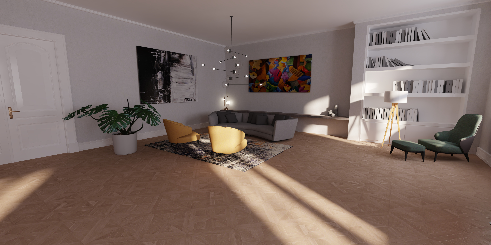
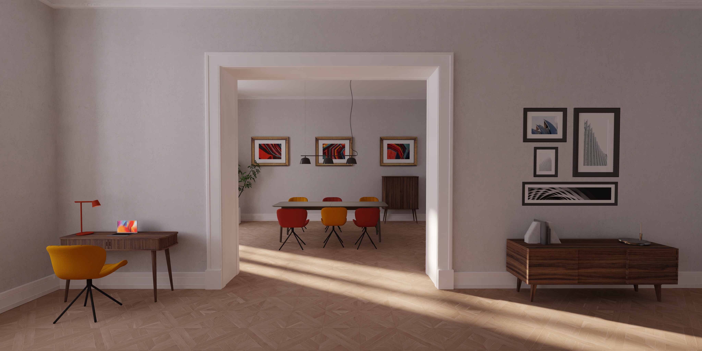
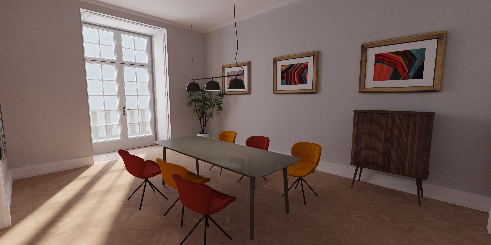

# Shapespark example room

This repository contains a complete textured 3D model of an interior:

You can explore it in 3D here: https://demo.shapespark.com/example-room/#autoplay

The example room is distributed toghether with Shapespark application,
but we make it available also on GitHub to allow modifying the model
and to enable experimenting with other rendering engines. The model is
prepared for real-time rendering, so it is a complete interior with
correct faces orientation and without any missing walls. The geometry
has **1.2** million trianges.

The provided model doesn't contain lightmap uvs and lightmap
textures visible on the screenshots above, the lighting on the
screenshots is added by the Shapespark engine.

The model is available in [GLTF](./shapespark-example-room-gltf.zip), [FBX](./shapespark-example-room-fbx.zip), [Blender](./shapespark-example-room.blend.zip) and [Sketchup](./shapespark-example-room.skp) formats.

